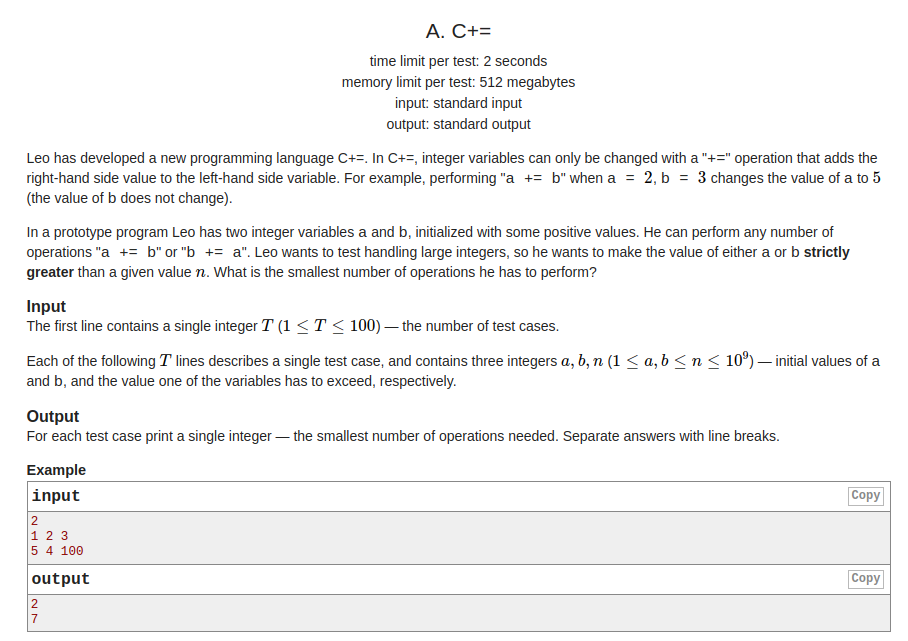
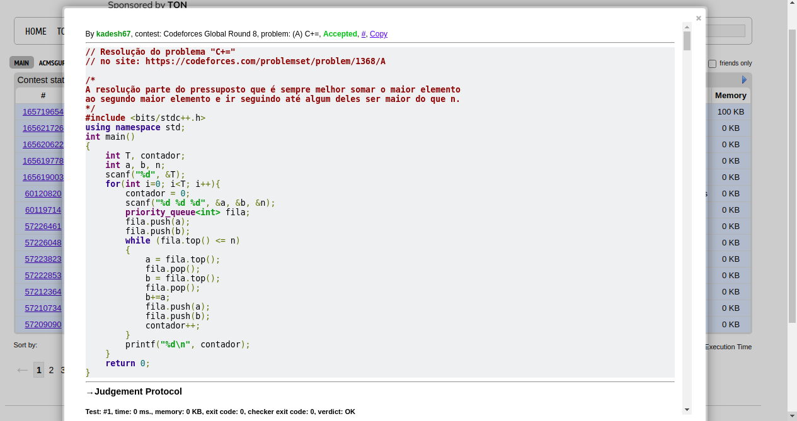
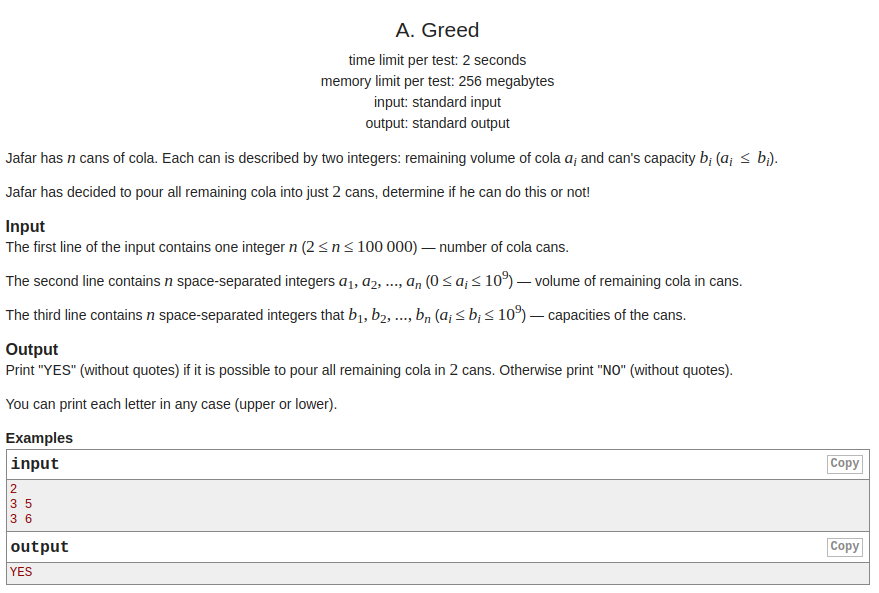
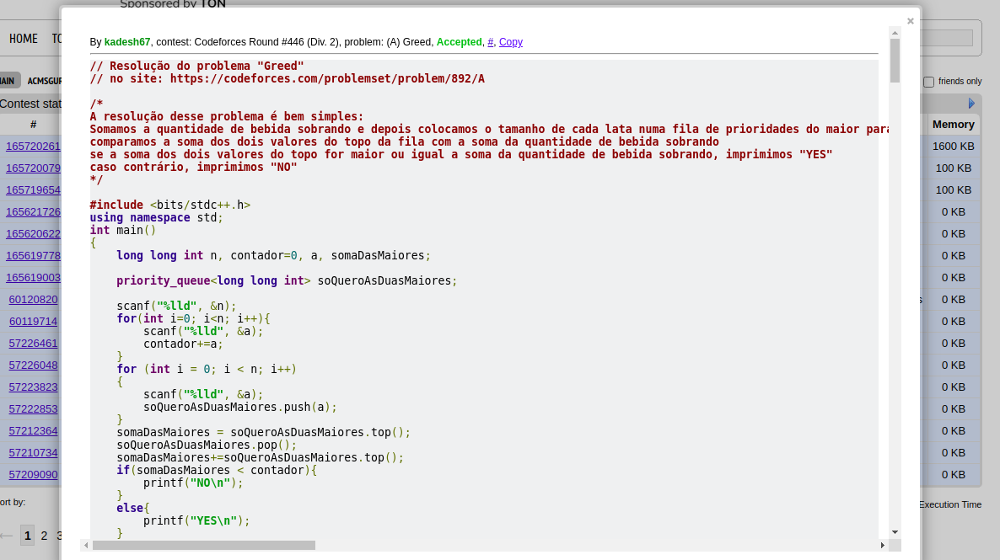
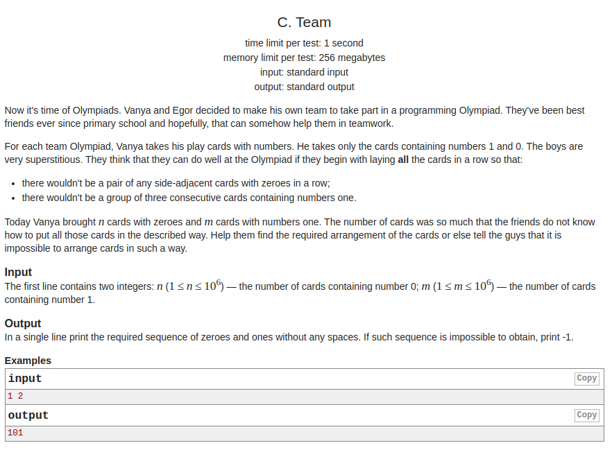
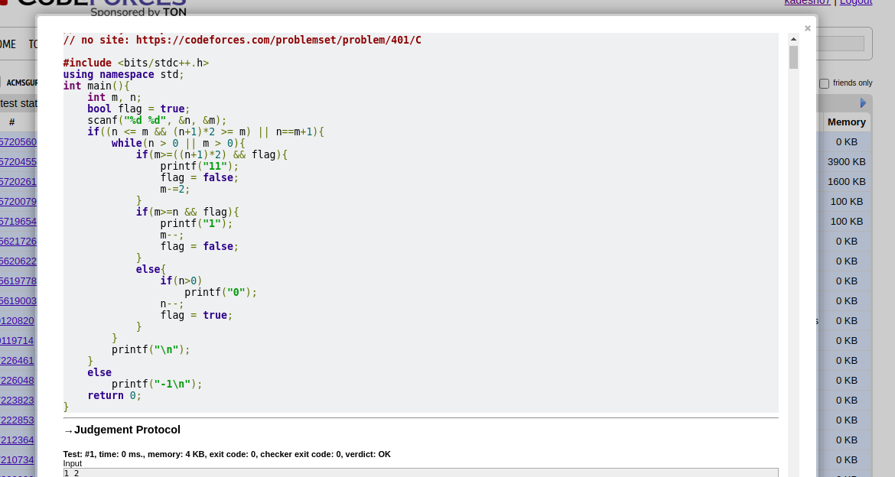
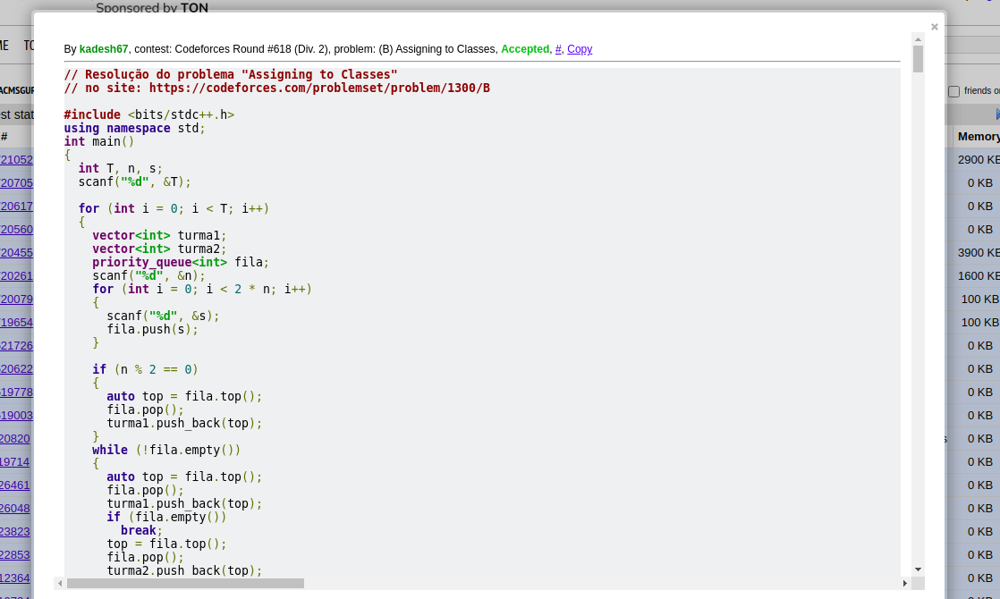

# Greedy Contest Problems

**Número da Lista**: 1<br>
**Conteúdo da Disciplina**: Greed<br>

## Alunos
|Matrícula | Aluno |
| -- | -- |
| 18/0015834  | Eliseu Kadesh Rosa Assunção Júnior  |
| 18/0037242	| Rodrigo Tiago Costa Lima   |

## Sobre 
O objetivo deste projeto é resolver alguns problemas de programação utilizando algoritmos ambiciosos (Greed).

## Instalação 
**Linguagem**: C++<br>

## Pré-requisitos:

- g++ >= 9.4.0;
- make >= 4.2.1;

## Uso 

Existem dois arquivos para cada questão, um .cpp para a compilação e outro .txt em que há algum caso de teste designado para a questão.

Para rodar qualquer uma das questões, primeiro entre na pasta da questão.

```
  cd ./nomeDaQuestão
```

Depois usando make compile o código da questão

```
  make build
```

Agora execute a questão com o binário gerado com o caso de teste exemplo.

```
  make run
```

ou simplesmente compile e rode com um só comando

```
  make
```
### C+= - [link](https://codeforces.com/problemset/problem/1368/A)



**Dificuldade:** 800

**Resolução:**

**Questão accepted**



### Dinner with Emma - [link](https://codeforces.com/problemset/problem/616/B)


**Dificuldade:** 1000

**Resolução:**

**Questão accepted**


### Greed - [link](https://codeforces.com/problemset/problem/892/A)



**Dificuldade:** 900

**Resolução:**

**Questão accepted**



### Tanya and Toys - [link](https://codeforces.com/problemset/problem/659/C)


**Dificuldade:** 1200

**Resolução:**

**Questão accepted**


### Team - [link](https://codeforces.com/problemset/problem/401/C)



**Dificuldade:** 1400

**Resolução:**

**Questão accepted**



### Vasya And Public Transport - [link](https://codeforces.com/problemset/problem/355/B)


**Dificuldade:** 1100

**Resolução:**

**Questão accepted**


### Watching A Movie - [link](https://codeforces.com/problemset/problem/499/A)


**Dificuldade:** 1000

**Resolução:** 

**Questão accepted**


### Assingning To Classes - [link](https://codeforces.com/problemset/problem/1300/B)


**Dificuldade:** 1000

**Resolução:** 

**Questão accepted**



## Outros 
Quaisquer outras informações sobre seu projeto podem ser descritas abaixo.