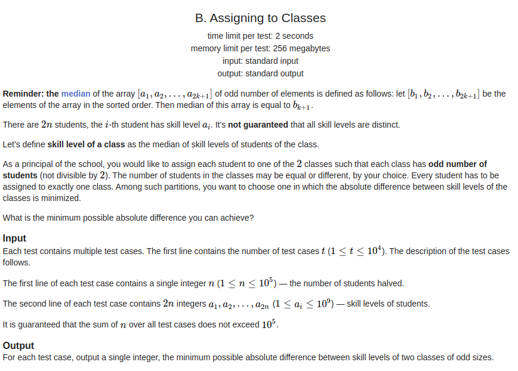

# Greedy Contest Problems

**Número da Lista**: 1<br>
**Conteúdo da Disciplina**: Greed<br>

## Alunos

|Matrícula | Aluno |
| -- | -- |
| 18/0015834  | Eliseu Kadesh Rosa Assunção Júnior  |
| 18/0037242	| Rodrigo Tiago Costa Lima   |

## Sobre 
O objetivo deste projeto é resolver alguns problemas de programação utilizando algoritmos ambiciosos (Greed).

## Instalação 
**Linguagem**: C++<br>

## Pré-requisitos:

- g++ >= 9.4.0;
- make >= 4.2.1;

## Uso 

Existem dois arquivos para cada questão, um .cpp para a compilação e outro .txt em que há algum caso de teste designado para a questão.

Para rodar qualquer uma das questões, primeiro entre na pasta da questão.

```
  cd ./nomeDaQuestão
```

Depois usando make compile o código da questão

```
  make build
```

Agora execute a questão com o binário gerado com o caso de teste exemplo.

```
  make run
```

ou simplesmente compile e rode com um só comando

```
  make
```
### C+= - [link](https://codeforces.com/problemset/problem/1368/A)


**Dificuldade:** 800

**Resolução:**
Somar o segundo maior com o maior e colocá-los de volta na fila de prioridades e repetir esse processo até que apareça um número maior do que n.

**Questão accepted**


### Greed - [link](https://codeforces.com/problemset/problem/892/A)


**Dificuldade:** 900

**Resolução:**
A resolução desse problema é bem simples:
Somamos a quantidade de bebida sobrando e depois colocamos o tamanho de cada lata numa fila de prioridades do maior para o menor
comparamos a soma dos dois valores do topo da fila com a soma da quantidade de bebida sobrando
se a soma dos dois valores do topo for maior ou igual a soma da quantidade de bebida sobrando, imprimimos "YES"
caso contrário, imprimimos "NO"

**Questão accepted**


### Dinner with Emma - [link](https://codeforces.com/problemset/problem/616/B)


**Dificuldade:** 1000

**Resolução:**
A resolução desse problema parte de uma interpretação de seu enunciado:
Emma quer maximizar o custo, Jack quer minimizá-lo e que Emma sabe das intenções de Jack,
a partir disso, podemos inferir que a Emma sempre vai escolher a rua cujo o menor elemento
é o maior se comparado com o menor elemento de qualquer outra rua. E que Jack vai só escolher
o menor elemento da rua.

Seguindo o texto acima temos que pode-se colocar, para cada rua, os elementos numa fila de prioridades que vai do menor para o maior,
colocar o elemento do topo numa fila de prioridades que vai do maior para o menor, e então imprimir o valor do topo.

**Questão accepted**


### Watching A Movie - [link](https://codeforces.com/problemset/problem/499/A)


**Dificuldade:** 1000

**Resolução:**

A solução desta questão consiste em realizar a soma do resto das durações dos intervalos entre as cenas importantes de um filme com o tempo que se pode pular o filme + a soma das durações das cenas importantes. Obtendo assim a quantidade mínima de minutos para assistir todas as cenas importantes do filme.

**Questão accepted**


### Assingning To Classes - [link](https://codeforces.com/problemset/problem/1300/B)



**Dificuldade:** 1000

**Resolução:**

Esse problema pede que sejam separados um conjunto de alunos em duas salas, tal que a diferença da mediana dos níveis dos alunos seja mínima.

O problema pede que o tamanho do conjunto de alunos por sala seja ímpar, mas o truque é, caso seja dividido de forma par, tirar a mediana desse conjunto fazendo a média dos dois elementos do meio.

Então adicionamos todos os alunos em uma fila de prioridade, e após isso começamos a retirar o aluno com maior prioridade (que nesse caso é o aluno com menor nível), e inserimos alternadamente em cada sala de aula, e ao final fazemos a diferença da mediana entre as duas salas.

**Questão accepted**


### Vasya And Public Transport - [link](https://codeforces.com/problemset/problem/355/B)


**Dificuldade:** 1100

**Resolução:**
Resolvemos esse problema considerando os seguintes pontos:

* Se vale a pena comprar um bilhete de viagens ilimitadas em ambos os tipos de transporte
* Se vale a pena comprar um bilhete de viagens ilimitadas para cada tipo de transporte
* Se vale a pena comprar um bilhete de viagens ilimitadas para um transporte específico
* Se vale a pena comprar um bilhete de viagem para cada viagem em um transporte.

Para saber o que mais vale a pena, pode-se realizar a comparação a seguir:
```
  se a quantidade de vezes que Vasya andar num transporte * o preço para cada viagem < o preço do bilhete de ilimitadas viagens naquele transporte:
    custo das viagens naquele tipo de transporte += (a quantidade de vezes que Vasya andar num transporte * o preço para cada viagem)
  senão:
    custo das viagens naquele tipo de transporte += o preço do bilhete de ilimitadas viagens naquele transporte
```
Tendo determinado o custo das viagens para cada tipo de transporte:
```
  se o custo das viagens em um tipo de transporte < o custo do bilhete de ilimitadas viagens naquele tipo de transporte:
    o custo das viagens naquele tipo de transporte = o custo do bilhete de ilimitadas viagens naquele tipo de transporte
```
E por fim:
```
  se a soma dos custos de cada tipo de transporte < o preço de um bilhete de viagens ilimitadas em ambos os transportes:
    imprima (a soma dos custos de cada tipo de transporte)
  senão:
    imprima (preço de um bilhete de viagens ilimitadas em ambos os transportes)
```

**Questão accepted**


### Tanya and Toys - [link](https://codeforces.com/problemset/problem/659/C)


**Dificuldade:** 1200

**Resolução:**
A resolução desse problema é bem simples, constrói-se um set (uma estrutura dados que não há repetição de elementos) para guardar
os brinquedos da Tanya, a partir disso, faça um loop que vai de 1 até m (que é o valor que a mãe de Tanya deixa ela gastar), e guarde num vetor qualquer elemento que não esteja no set e decremente no valor do elemento.
Ao sair do loop, imprima a quantidade de elementos no vetor e cada elemento que nele há.

**Questão accepted**


### Team - [link](https://codeforces.com/problemset/problem/401/C)


**Dificuldade:** 1400

**Resolução:**
A resolução desse problema tem dois passos: decidir se a proporção de 0's para 1's é válida e imprimir a string resultante:

* A proporção é válida se a (quantidade de 0's for menor ou igual a quantidade de 1's e a (quantidade de 0's + 1)*2 for maior ou igual a quantidade de 1's) ou se a quantidade de 0's for igual a quantidade de 1's mais 1.
* A partir disso, tem-se que escolher como imprimir, a minha estratégia foi imprimir o máximo de 1's até a quantidade de 0's e 1's ser igual.

**Questão accepted**

